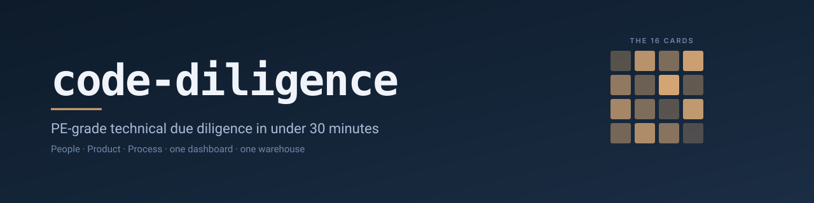

<p align="center">
  
</p>

<p align="center">
  <a href="LICENSE"></a>
  <a href=".claude-plugin/plugin.json"></a>
  <a href="https://claude.com/claude-code"></a>
</p>

---

> **The deal team has 30 minutes before the next partner call. The target owns 280 git repos. You need to know who carries bus-factor risk, where the hotspots are, what looks abandoned, and whether engineering hygiene is a problem.**
>
> `code-diligence` answers those questions in one command.

## What you get

One **Observable dashboard** per target, covering **16 cards** across three diligence axes:

| Axis | Cards |
|---|---|
| **People** | bus-factor map · knowledge concentration · contributor activity timeline · communication graph · hero-dependency register |
| **Product** | hotspot map · hidden coupling · code-aging chart · burndown over time · abandoned-area register · tech-stack drift |
| **Process** | DORA quadrant · review discipline · CI health · issue-triage health · working-pattern signals *(privacy-gated, off by default)* |

Each card has narrated prose telling you what to notice. A read-only chat agent answers follow-up questions ("why is the payments-service a hotspot?") with citations back to the warehouse and the repo.

## The entire workflow

```text
analyst:  /code-diligence:ingest acme --quick
plugin:   [20-30 min · ~280 repos processed · dashboard ready]

analyst:  /code-diligence:ask acme why is the payments-service a hotspot?
plugin:   [Cites specific commits, contributors, and complexity scores
           from the warehouse — read-only, evidence-anchored.]

analyst:  /code-diligence:refresh acme    # before the next deal stage
plugin:   [Incremental fetch + full-tier rerun · analyst-confirmed
           curations preserved.]
```

That is the whole interaction. No notebooks, no SQL, no exports.

## At a glance

|  |  |
|---|---|
| **Time to first dashboard** | ⏱ under 30 minutes (quick tier, ~280 repos) |
| **Full diligence run** | 🔍 1–3 hours (adds hercules, code-maat, repowise, GitHub platform pass) |
| **Reproducibility** | 🔁 idempotent pipeline; analyst-confirmed curations survive every rerun |
| **Privacy posture** | 🔒 per-person commit-time heatmaps are off until you explicitly opt in |
| **Cost model** | 💰 runs entirely on your machine; no SaaS, no third-party data egress |
| **License** | 📄 MIT |

## Standing on giants

`code-diligence` doesn't reinvent the underlying analysis — decades of brilliant open-source work already exists. The plugin's job is the *stitching*: one warehouse, one schema, one card map, one dashboard, so a deal team gets diligence-grade signal without learning seven tools first.

The proven analyzers it brings together:

[**git-fame**](https://github.com/casperdcl/git-fame) — authorship + bus-factor signal ·
[**git-of-theseus**](https://github.com/erikbern/git-of-theseus) — code-aging curves ·
[**git-truck**](https://github.com/git-truck/git-truck) — repo visualization ·
[**hercules**](https://github.com/src-d/hercules) — deep commit-history analysis ·
[**code-maat**](https://github.com/adamtornhill/code-maat) — hotspots + temporal coupling (the *Your Code as a Crime Scene* canon) ·
[**repowise**](https://github.com/repowise-dev/repowise) — repo health metrics ·
[**Observable Framework**](https://observablehq.com/framework) — the dashboard runtime

Each tool retains its own license; see each repository. The user experience is meant to transcend any individual tool — you get powerful, evidence-anchored results without needing to know which analyzer fed which card.

## Install

Skills are portable across modern agentic clients. Pick yours — one line each:

### Claude Code — full pipeline
```sh
claude plugin marketplace add AeyeOps/aeo-diligence-marketplace
claude plugin install code-diligence@aeo-diligence
```
Commands, hooks, MCP, and the Observable dashboard. The recommended path.

### Codex CLI — analysis skills
Inside a Codex session, type:
```text
$skill-installer AeyeOps/aeo-diligence-marketplace
```
Installs the People / Product / Process diligence-axis skills into `~/.codex/skills/`. See the [Codex skills docs](https://developers.openai.com/codex/skills).

### Gemini CLI — extension
```sh
gemini extensions install https://github.com/AeyeOps/aeo-diligence-marketplace
```
Discoverable in the [Gemini CLI extensions](https://geminicli.com/docs/extensions/) marketplace.

## Configure your first target

> Paths below show the Claude Code layout. Codex / Gemini installs adjust to their own plugin paths.

Copy the example settings, point it at the GitHub orgs you want to diligence, and set the env var that holds your PAT:

```sh
cp ~/.claude/plugins/code-diligence/settings/diligence.example.local.md \
   ~/.claude/code-diligence-<target>.local.md
export ACME_DILIGENCE_GH_TOKEN=ghp_...
```

Run the ingest:

```text
/code-diligence:ingest acme --quick
```

When it finishes, open the dashboard:

```sh
python -m http.server -d ~/data/code-diligence/dashboard
# → http://localhost:8000
```

> **Optional analysis tools** (`git-fame`, `git-of-theseus`, `hercules`, `code-maat`, `repowise`) unlock additional cards. The pipeline detects what's installed and gracefully skips the rest — missing tools become "data unavailable" on the affected cards, never a failure. Install whatever subset matches the depth you need.
>
> Full optional-tool install commands: [Installing the optional analysis tools](#installing-the-optional-analysis-tools) below.

## Reading the output

If you're new to diligence-grade code analysis, the per-axis explainers are the fastest way in — they tell you what each card means and how to read it:

- 👥 [**People axis**](skills/understanding-pe-diligence-axes/references/people.md) — bus factor, knowledge concentration, hero dependencies
- 🧱 [**Product axis**](skills/understanding-pe-diligence-axes/references/product.md) — hotspots, coupling, code aging, abandoned areas
- ⚙️ [**Process axis**](skills/understanding-pe-diligence-axes/references/process.md) — DORA, review discipline, CI health

When a card shows "low confidence," it means the underlying source data was incomplete — usually because an optional tool wasn't installed or the GitHub token lacked scope. The dashboard's Health tab tells you exactly which.

## License

[MIT](LICENSE) · Copyright © 2026 AeyeOps

---

<details>
<summary><strong>Installing the optional analysis tools</strong></summary>

The plugin runs without any of these. Each adds capability — install whatever subset matches the depth you need.

```sh
brew install uv node openjdk@17 go
uv tool install git-fame git-of-theseus
go install github.com/src-d/hercules/cmd/hercules@latest

# code-maat JAR (one-time vendor)
cd ~/.claude/plugins/code-diligence/vendor
curl -LO https://github.com/adamtornhill/code-maat/releases/download/<version>/code-maat-<version>-standalone.jar
```

`git-truck` is invoked via `npx -y git-truck@3.3.0` by the wrapper — no global install needed.

Which tool feeds which card: [`skills/ingesting-target/references/tool-prerequisites.md`](skills/ingesting-target/references/tool-prerequisites.md).

</details>

<details>
<summary><strong>For developers and contributors</strong></summary>

This is shipped as a ready-to-use plugin, not an open contribution surface — there is no contribution guide and no roadmap solicitation. That said, if you want to fork, change, or extend it locally:

```sh
uv sync
uv run pytest      # ~140 tests, ~3 min
uv run ruff check .
uv run pyright
```

Tests for individual external tools skip cleanly when the binary is absent, so the suite is green even on a bare Mac.

**Internals deeper than the README goes:**

- [Per-tool wrapper notes](skills/interpreting-tool-output/SKILL.md) — what each tool does and which warehouse column it populates
- [Pipeline stages](skills/ingesting-target/references/pipeline-stages.md) — the 10 stages of `code-diligence ingest`
- [Privacy gate decision matrix](skills/building-dashboard/references/privacy-gate.md) — the working-pattern card opt-in
- [Changelog](CHANGELOG.md) — what changed in each release

</details>
